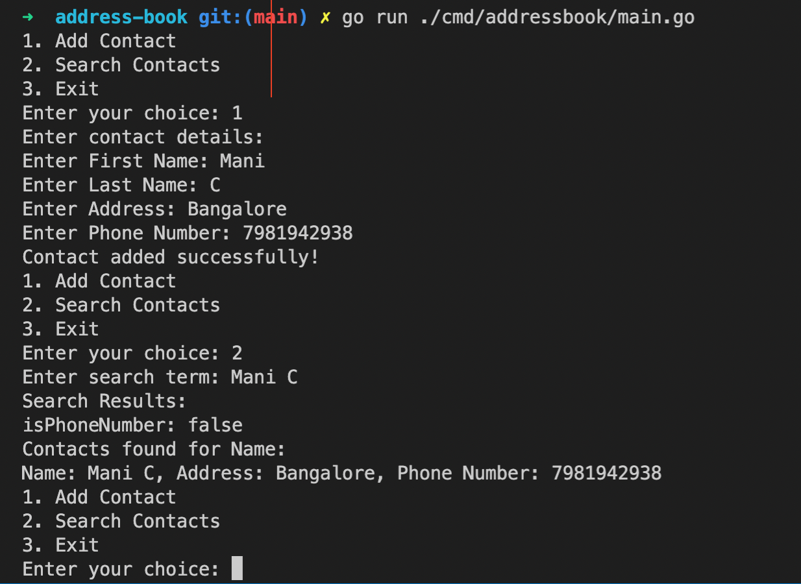
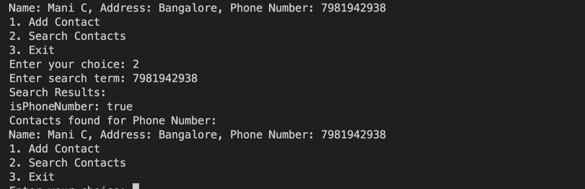

# Address-Book

1. Run the main.go file or executable file to start the program
2. Provide your option to add or search contact
3. To search by name you need to provide the fullname -> `firstName latName`
4. To make searchable easier, we are storing records by combinatino of `firstName+' '+lastName`

Sample output:

## Further Optimization:
### Concurrency:
#### The current implementation uses a simple read-write mutex for thread safety. For higher performance, especially with concurrent searches, consider using more advanced concurrency patterns or lock-free data structures.

